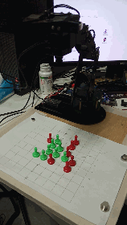
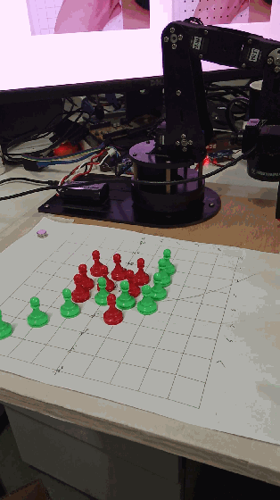

## 机械臂版本（学弟优化版）  
* DFS
* 机械臂 Lebot
* 语音模块 WEGASUN-M6

## Demo

| Demo1 | Demo2 |
|:---------|:--------------------|
|   |  |

## 参考资料
* 百行内实现五子棋人机对战 - Skywind Inside - CSDN博客  https://blog.csdn.net/skywind/article/details/8164713